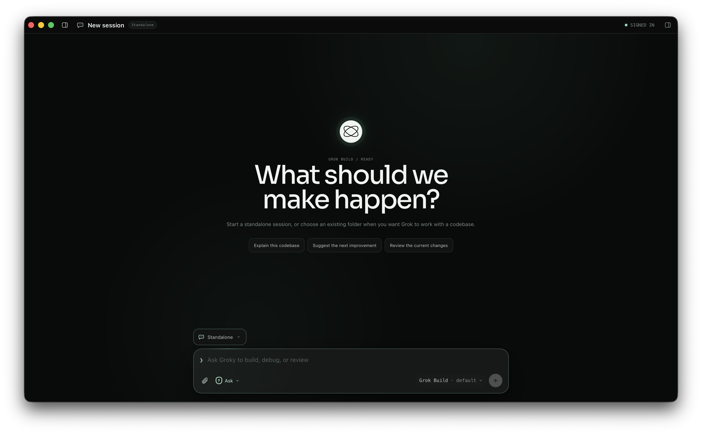
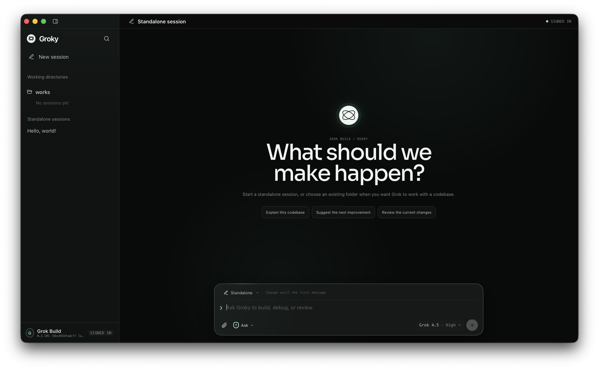

<h1 align="center">
  
</h1>

<p align="center">
  The open-source desktop client for Grok Build.
</p>

<p align="center">
  Run multiple Grok Build sessions across your projects, follow their progress, and stay in control.
</p>

<p align="center">
  <a href="#install-groky">Install</a> ·
  <a href="#what-works-today">Features</a> ·
  <a href="#getting-started">Getting started</a> ·
  <a href="#development">Development</a> ·
  <a href="CONTRIBUTING.md">Contributing</a>
</p>

> [!WARNING]
> Groky is an early release under active development. Features, stored navigation metadata, and compatibility may change between releases.

> [!IMPORTANT]
> Groky is an independent, unofficial project and is not affiliated with or endorsed by xAI.

<p align="center">
  
</p>

<p align="center">
  
</p>

<p align="center">
  <strong><a href="https://github.com/ti-ebi/groky/releases/latest">Download the latest release</a></strong>
</p>

## Why Groky

Grok Build is a powerful coding agent. Groky turns its local CLI into a persistent desktop workspace for projects, standalone tasks, and concurrent sessions.

- **Persistent navigation:** Group sessions by working directory, switch between active runs, reopen saved sessions, and keep archived work out of the main sidebar.
- **Flexible starting point:** Choose an existing folder or use a managed standalone directory created by Groky.
- **Local integration:** Groky launches the official Grok Build CLI on your machine and communicates with it over the Agent Client Protocol (ACP).
- **Human in the loop:** Review permission requests, choose an approval mode per session, and stop an active turn at any time.
- **Focused interface:** Follow Markdown responses, thoughts, plans, compact execution traces, live timing, usage, and turn metrics without leaving the app.
- **Workspace tools:** Browse and preview files, attach workspace files to a prompt, and use one or more interactive terminals from a resizable tools panel.
- **Native desktop host:** Process and filesystem access stay behind typed Tauri commands in the Rust host.

## What works today

| Area | Current support |
| --- | --- |
| Onboarding | Grok CLI detection, cached-auth checks, device-code sign-in, and `XAI_API_KEY` support when advertised by the CLI |
| Session creation | A location, model, reasoning effort, and approval mode can be prepared before the ACP session is created on the first message |
| Working directories | Tracked local folders and managed standalone directories under `Documents/Groky/YYYY-MM-DD/` |
| Session history | Local navigation metadata, session reload when supported by Grok Build, rename, archive, restore, delete, unread state, and approval-needed indicators |
| Multi-session work | Switch between sessions while turns continue in the background and return when a response or permission request needs attention |
| Search and navigation | Working-directory groups, resizable and collapsible sidebar and tools panel, a global session/action search palette, and responsive message-history navigation |
| Composer | Text prompts, up to 10 file attachments through the picker or drag and drop, and suggestions for slash commands advertised by Grok Build |
| Live activity | Streamed GitHub-Flavored Markdown, thoughts, plans, compact or collapsible execution events, per-event and per-turn timing, permission decisions, completion state, and usage, cost, or turn metrics when reported by Grok Build |
| Workspace files | Live file tree with hidden-file controls, system file-manager actions, syntax-highlighted text and Markdown previews, image, PDF, and font previews, and one-click attachment to the next message |
| Terminals | Multiple interactive shell tabs rooted in the selected working directory, with resize, restart, close, and drag or keyboard tab reordering |
| Permissions | **Ask** and **Always approve** session modes, plus interactive choices supplied by each tool permission request |
| Model controls | Model and reasoning-effort selection when advertised by Grok Build |
| Session controls | Start on first send, stop, reconnect, switch, rename, archive, restore, delete, and sign out |
| Settings | Application version, updater status, CLI and active-session details, signed-in account information, Grok usage access, account controls, and searchable archived chats |
| Updates | Signed in-app updates backed by GitHub Releases |

## Install Groky

Groky runs the official Grok Build CLI on your computer. Install the CLI first, then choose the Groky package for your operating system.

### 1. Install Grok Build

Follow the [official Grok Build installation guide](https://docs.x.ai/build/overview). On macOS, Linux, or WSL:

```bash
curl -fsSL https://x.ai/cli/install.sh | bash
grok --version
```

Groky uses the official CLI as its agent runtime. You can sign in during Groky's onboarding flow, so starting an interactive `grok` session first is optional.

Groky checks `GROK_BINARY`, your `PATH`, `~/.local/bin`, and `~/.grok/bin` when locating the CLI. Set `GROK_BINARY` to the executable path if Grok Build is installed somewhere else.

> [!NOTE]
> The CLI must be available in the same operating-system environment as Groky. In particular, the native Windows app cannot automatically use a Grok Build installation that exists only inside WSL.

### 2. Download Groky

Download Groky only from the official [GitHub Releases page](https://github.com/ti-ebi/groky/releases/latest). Expand **Assets** and select the package that matches your computer:

| Operating system | Package to download | Architecture |
| --- | --- | --- |
| macOS on Apple Silicon | `Groky_*_aarch64.dmg` | Apple M1 or later |
| macOS on Intel | `Groky_*_x64.dmg` | Intel 64-bit |
| Windows | `Groky_*_x64-setup.exe` | x86-64 |
| Debian or Ubuntu | `Groky_*_amd64.deb` | x86-64 |
| Other Linux distributions | `Groky_*_amd64.AppImage` | x86-64 |

#### macOS

Open the `.dmg`, then drag **Groky** into the **Applications** folder. macOS release builds are code signed and notarized by Apple.

#### Windows

Run `Groky_*_x64-setup.exe` and follow the installer. The Windows installer is signed for Groky's in-app updater, but it is not yet Authenticode code signed, so Windows SmartScreen may show an unrecognized-publisher warning. Confirm that the file came from `github.com/ti-ebi/groky` before continuing.

#### Debian or Ubuntu

```bash
sudo apt install ./Groky_*_amd64.deb
```

#### Other Linux distributions

Make the AppImage executable, then run it:

```bash
chmod +x Groky_*_amd64.AppImage
./Groky_*_amd64.AppImage
```

Files ending in `.sig`, `.app.tar.gz`, and `latest.json` are used by the signed automatic updater. You do not need to download them for a manual installation.

## Getting started

Start Groky from your Applications folder, Start menu, or application launcher. On first launch, Groky:

1. Detects the local Grok Build CLI.
2. Checks the CLI's cached authentication state.
3. Starts the official device-code flow when sign-in is required.
4. Restores locally tracked working directories and session navigation metadata.
5. Lets you choose an existing folder or a standalone location, approval mode, model, and reasoning effort.
6. Creates the Grok Build ACP session only when you send the first message.

The verification code shown by Groky should match the code shown in the browser. The CLI detects approval automatically; there is no token or code to paste back into Groky.

Groky can also use an existing `XAI_API_KEY` environment variable when the CLI advertises that authentication method. Groky does not persist the key.

Standalone sessions use a unique directory inside `Documents/Groky/YYYY-MM-DD/`. Removing a session from Groky history does not delete the files in that directory.

Session titles start from the first message or attachment name and can be renamed later. Saved sessions can be reopened when the installed Grok Build version advertises ACP session loading.

The tools panel's **Files** tab follows the active session, watches its working directory for changes, previews supported files without leaving Groky, and can attach a selected file to the next message. Each new **Terminal** tab runs your system shell in the working directory that was active when the tab opened. You can open multiple terminals, close tool tabs, and reorder tabs by dragging them or pressing <kbd>Alt</kbd> + <kbd>←</kbd>/<kbd>→</kbd> while a tab is focused.

Useful keyboard controls:

- <kbd>Command</kbd>/<kbd>Ctrl</kbd> + <kbd>K</kbd> searches sessions and common actions.
- <kbd>Command</kbd>/<kbd>Ctrl</kbd> + <kbd>B</kbd> toggles the sidebar.
- <kbd>Command</kbd>/<kbd>Ctrl</kbd> + <kbd>J</kbd> toggles the tools panel.
- <kbd>Enter</kbd> sends a message; <kbd>Shift</kbd> + <kbd>Enter</kbd> inserts a new line.
- Typing `/` opens the command catalog supplied by Grok Build.

## How it works

```text
React renderer
      │ typed Tauri commands and events
      ▼
Tauri Rust host
      │ JSON-RPC over stdin/stdout
      ▼
Grok Build CLI (`grok agent stdio`)
```

The React renderer does not start processes or access the filesystem directly. The Rust host owns CLI discovery, authentication commands, working-directory access and watching, file previews, terminal PTYs, ACP transport, permission responses, cancellation, and updates. Workspace file commands resolve canonical paths beneath the active session's working directory before reading or opening them.

ACP events are routed by session, so a turn can continue while another session is open. Groky stores lightweight navigation metadata locally and requests conversation replay from Grok Build when reopening a saved session.

Closing Groky stops active Grok Build processes, terminal sessions, and workspace watchers.

Grok Build itself handles model and network communication. Prompts and project context are processed according to xAI's Grok Build service and data policies; see the official [Grok Build documentation](https://docs.x.ai/build/overview).

## Privacy and security

- Groky delegates authentication to the official Grok Build CLI.
- Groky does not read or store the resulting browser-auth token.
- Groky stores session IDs, titles, working-directory paths, approval modes, timestamps, archive state, and unread state in the operating system's application-data directory. The initial title is derived from the first message or attachment name.
- Groky does not persist full conversation bodies or source-file contents in its own history files, and it does not write prompts, responses, credentials, or raw ACP traffic to application logs.
- Attached files are not copied into Groky. Their validated local paths and metadata are passed to Grok Build as ACP resource links.
- Files opened in the tools panel are read on demand for an in-memory preview. Text previews are capped at 512 KiB, font previews at 8 MiB, and supported image or PDF previews at 20 MiB.
- Terminal tabs run your local system shell with the session working directory as their current directory. Commands entered there have the same local access as that shell.
- Local processes and filesystem access are initiated through the Tauri Rust host, not the renderer.
- Deleting Groky history does not delete files in the associated working directory.
- **Always approve** skips individual prompts unless a policy rule still requires approval. Use it only in a working directory you trust.
- The Grok Build CLI and xAI service may retain their own session data independently of Groky; consult the official documentation for their behavior and policies.

## Development

Requirements:

- Node.js 24 or later
- pnpm 10
- Rust 1.88 or later
- Grok Build CLI

Clone the repository, install dependencies, and run the desktop application:

```bash
git clone https://github.com/ti-ebi/groky.git
cd groky
pnpm install
pnpm tauri dev
```

To preview the renderer without starting local processes:

```bash
pnpm dev
```

### Tech stack

- Tauri 2 and Rust
- React 19, TypeScript, and Vite
- xterm.js with a Rust-hosted pseudoterminal
- pnpm
- A typed ACP client powered by Grok Build's `grok agent stdio`

### Verification

```bash
pnpm check
cargo fmt --manifest-path src-tauri/Cargo.toml --check
```

`pnpm check` runs the frontend typecheck and build, TypeScript timing tests, all Rust unit tests, and `cargo check`.

## Contributing

Community contributions are accepted through [GitHub Issues](https://github.com/ti-ebi/groky/issues/new/choose). Read [CONTRIBUTING.md](CONTRIBUTING.md) before submitting a report or proposal.

- Search existing issues before opening a new one.
- Use the appropriate form for a bug, feature request, or documentation improvement.
- Keep each issue focused on one topic and remove sensitive information from all reports and attachments.
- Do not open a pull request unless a maintainer invites you to implement an accepted issue.

## Releasing

<details>
<summary>Maintainer release process</summary>

Groky checks `https://github.com/ti-ebi/groky/releases/latest/download/latest.json` for signed desktop updates. The public updater key is committed in `src-tauri/tauri.conf.json`; keep its private key outside the repository and back it up securely.

Configure these GitHub Actions secrets before the first release:

- `TAURI_SIGNING_PRIVATE_KEY` with the contents of `~/.tauri/groky.key`
- `TAURI_SIGNING_PRIVATE_KEY_PASSWORD` when the updater key is password-protected
- `APPLE_CERTIFICATE`, `APPLE_CERTIFICATE_PASSWORD`, and `APPLE_SIGNING_IDENTITY` for macOS code signing
- `APPLE_ID`, `APPLE_PASSWORD`, and `APPLE_TEAM_ID` for macOS notarization

For each release:

1. Update the version in `package.json`, `src-tauri/Cargo.toml`, and `src-tauri/tauri.conf.json`.
2. Merge the release commit into `develop`.
3. Open a pull request from `develop` to `main` and merge it after its required checks pass. The merge automatically starts the **Release** workflow.
4. Wait for every matrix job to finish and inspect the draft GitHub Release.
5. Test each installer on its target operating system before publishing the draft.

The [release workflow](.github/workflows/release.yml) runs when a version change in `src-tauri/tauri.conf.json` reaches `main`. It builds both macOS architectures, Windows NSIS, and Linux AppImage/DEB artifacts, signs updater bundles, generates `latest.json`, and creates a draft GitHub Release. If a run must be retried manually, run the workflow with `main` selected. Publish the draft only after testing its installers.

Before publishing, confirm that the draft contains:

- Apple Silicon and Intel `.dmg` installers, plus their signed `.app.tar.gz` updater bundles.
- The Windows NSIS `.exe` installer and its `.sig` file.
- Linux `.AppImage` and `.deb` packages and both `.sig` files.
- A `latest.json` whose version and platform entries match the uploaded updater bundles.
- Release notes that clearly describe user-visible changes and any known limitations.

After publishing, verify the public [latest release](https://github.com/ti-ebi/groky/releases/latest) and the [updater manifest](https://github.com/ti-ebi/groky/releases/latest/download/latest.json). Do not replace assets on a published release; ship a new patch release if an installer or updater manifest must be corrected.

An installation that predates updater support cannot discover the updater-enabled release. Existing users must install that first release manually once; later releases can update inside Groky.

</details>

## License

Groky is available under the [Apache License 2.0](LICENSE).
